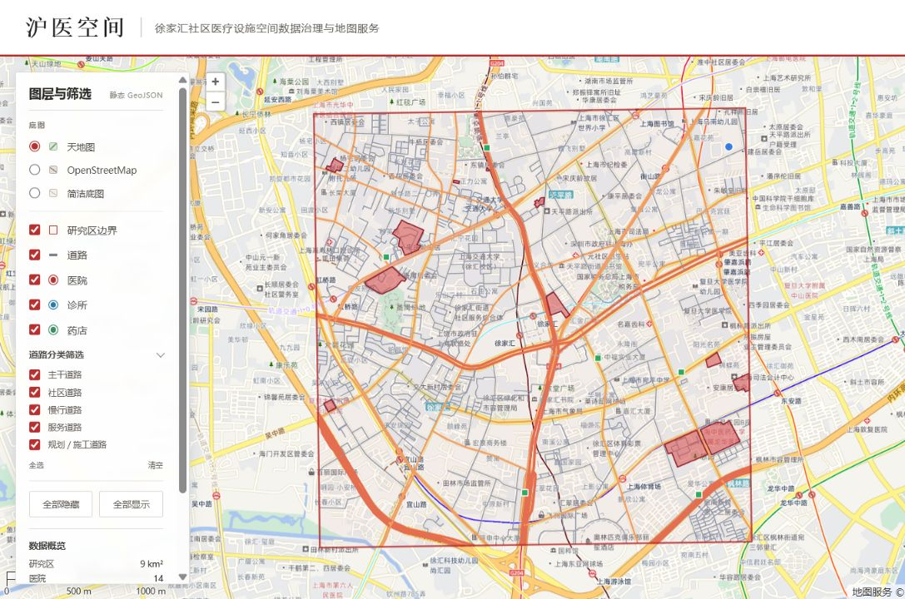
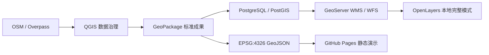

# 沪医空间（Shanghai MedMap）

上海社区医疗设施空间数据治理与地图服务项目

[](https://github.com/cokaleX/shanghai-medmap-gis/actions/workflows/deploy-pages.yml)

[在线演示](https://cokalex.github.io/shanghai-medmap-gis/) · [源码仓库](https://github.com/cokaleX/shanghai-medmap-gis) · [完整学习与验证记录](docs/learning_log.md)



## 项目概览

本项目以徐家汇公共地标周边约9平方公里为研究区，完整实践了从开放空间数据获取、GIS数据治理、PostGIS空间分析、GeoServer地图服务发布到OpenLayers WebGIS展示的工作流程。

公开网页使用静态GeoJSON展示核心成果，便于直接访问；本地完整模式通过PostGIS和GeoServer提供WMS、WFS及GetFeatureInfo服务。项目不用于医疗诊断、医疗决策或医院质量评价。

## 核心成果

- 建立3千米 × 3千米研究区，工作坐标系为EPSG:32651。
- 对OSM医院、诊所、药店和道路数据完成裁剪、重投影、几何检查、重复检查及字段标准化。
- 形成医院14条、诊所1条、药店6条、道路线1095条标准成果，并保留可追溯的 `source_id`。
- 在PostGIS中建立主键、来源ID唯一约束、非空约束和GiST空间索引。
- 使用空间SQL完成设施分类统计、1千米范围查询、最近道路查询，并用 `EXPLAIN (ANALYZE, BUFFERS)` 对比索引最近邻与全量距离排序。
- 使用只读数据库账号在GeoServer发布WMS/WFS服务，配置可版本控制的SLD样式和组合图层组。
- 构建OpenLayers交互地图，实现图层控制、道路分类筛选、设施属性气泡、天地图/OSM/简洁底图切换和移动端抽屉。
- 通过GitHub Actions自动构建并发布GitHub Pages静态演示，同时明确其与公网后端服务的能力边界。

## 技术架构



| 环节 | 技术与用途 |
|---|---|
| 数据获取 | OpenStreetMap、QuickOSM、Overpass API |
| 数据治理 | QGIS、GeoPackage、EPSG:32651 |
| 空间数据库 | PostgreSQL 18、PostGIS 3.6、GiST索引、空间SQL |
| 地图服务 | GeoServer 3、WMS、WFS、SLD、只读数据库角色 |
| WebGIS | OpenLayers 10、JavaScript、Vite、GeoJSON |
| 发布 | Git、GitHub Actions、GitHub Pages |

## WebGIS功能

- 医院、诊所、药店、道路和研究区边界独立显示控制。
- 道路按主干、社区、慢行、服务、规划/施工五组筛选。
- 点击医疗设施查看名称、设施类型、来源编号和数据来源。
- 天地图矢量底图与中文注记为国内演示默认底图，并保留OpenStreetMap和项目道路简图两级备选。
- 720px以下使用默认收起的图层抽屉，保证主要地图区域可浏览。
- 本机默认进入GeoServer服务模式，非本机域名自动使用静态GeoJSON模式。

## 项目结构

```text
data/               OSM原始数据、处理过程数据与标准成果
docs/               数据来源、字段字典、环境配置和学习日志
geoserver/styles/   可版本控制的SLD样式
qgis/               QGIS项目文件
sql/                已验证的PostGIS查询脚本
web/                OpenLayers与Vite前端、静态演示数据
.github/workflows/  GitHub Pages自动部署工作流
```

## 运行方式

### 静态演示模式

```powershell
git clone https://github.com/cokaleX/shanghai-medmap-gis.git
cd shanghai-medmap-gis\web
npm ci
npm run dev -- --host 127.0.0.1
```

访问 `http://127.0.0.1:5173/?mode=static`。未配置天地图密钥时会自动使用OpenStreetMap，也可通过 `?basemap=local` 验证无在线底图场景。

如需本地测试天地图，可复制 `web/.env.example` 为 `web/.env.local` 并填写 `VITE_TIANDITU_TOKEN`。真实密钥不会进入Git；生产环境通过GitHub Actions Secret注入，并使用域名白名单限制调用来源。

### 本地完整服务模式

本地完整模式需要先启动PostgreSQL/PostGIS和GeoServer，再在 `web` 目录运行开发服务器。数据库、GeoServer和前端配置说明分别见：

- [PostgreSQL/PostGIS配置](docs/database_setup.md)
- [GeoServer发布配置](docs/geoserver_setup.md)
- [数据字段字典](docs/data_dictionary.md)
- [数据来源与许可](docs/data_source.md)

## 数据范围与限制

- 研究区中心使用徐家汇站公共坐标作为可复现参考，不涉及个人家庭住址。
- 设施数量只反映2026-07-12获取时OpenStreetMap中已标注且通过本项目规则清洗的对象，不代表完整、实时或官方医疗机构名录。
- 医院面到目标点的距离采用几何最短距离，不等同于入口距离或实际出行距离。
- GitHub Pages只托管静态前端和GeoJSON，不代表PostGIS与GeoServer后端已部署到公网。

## 许可与署名

- 本项目自行编写的代码采用 [MIT License](LICENSE)。
- OSM原始数据及其衍生成果遵循Open Database License（ODbL），数据署名为 © OpenStreetMap contributors。
- 天地图和OpenStreetMap在线底图仅作为参考地图服务使用，分别遵循其服务条款与署名要求。

## 项目说明

这是本人完成的第一个完整GIS全流程学习项目。项目在AI指导与辅助下逐步实施，本人负责实际软件操作、数据处理、结果验证、问题复现和Git提交管理；完整过程、错误与验证证据保留在 [学习日志](docs/learning_log.md) 中。
